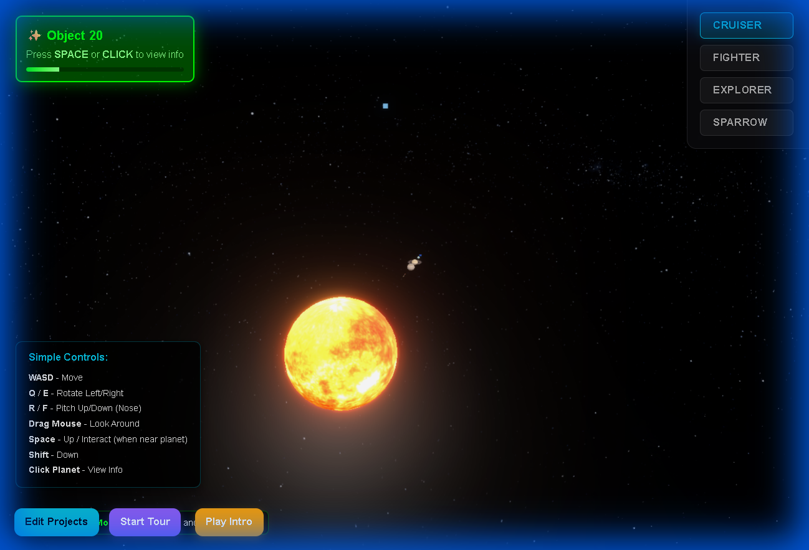
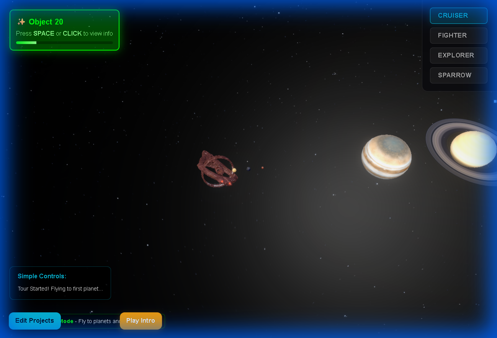
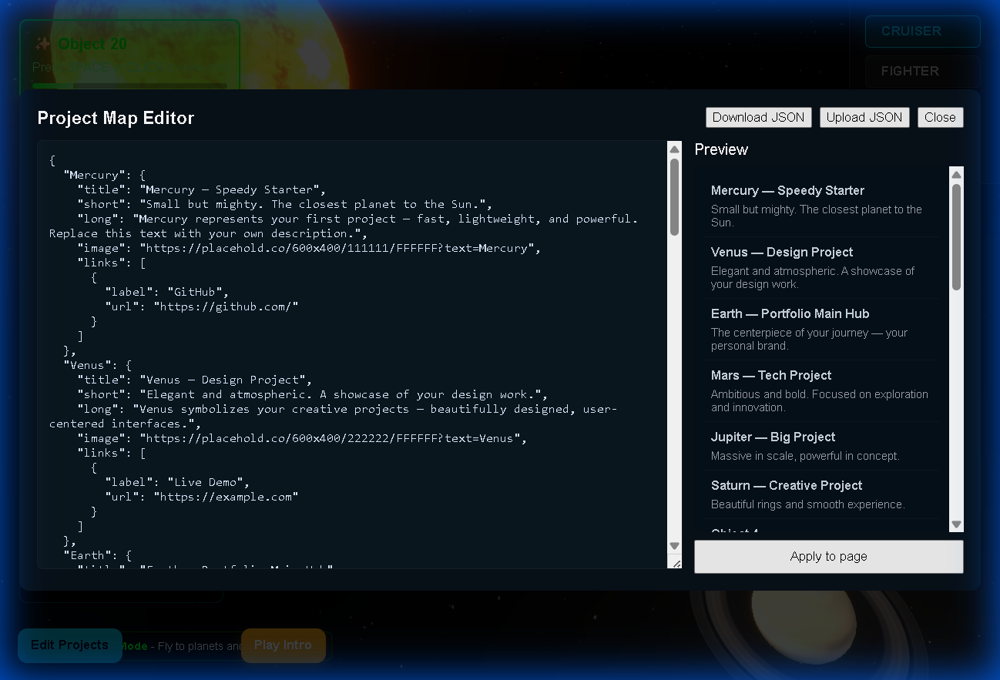

# 🚀 Solar System Explorer Portfolio

<div align="center">


**An immersive 3D game-based portfolio website where you pilot a spaceship through a realistic solar system to explore your professional journey.**

[Features](#-features) • [Quick Start](#-quick-start) • [Controls](#-controls) • [Deploy](#-deployment) • [Customize](#-customization)

</div>

---

## ✨ Overview

Transform your portfolio into an interactive space exploration experience! This **production-ready** project combines cutting-edge 3D graphics, game mechanics, and professional presentation to create a unique portfolio that stands out. Navigate through planets representing different sections of your work, each with its own visual identity and content.

### 🎯 Why This Portfolio?

- ✅ **Production Ready** - Optimized and ready to deploy immediately
- 🎮 **Interactive Experience** - Engage visitors with game-like controls
- 🌍 **Unique Presentation** - Stand out from traditional portfolios
- ⚡ **Performance Optimized** - Smooth on desktop and mobile devices
- 📱 **Fully Responsive** - Works seamlessly on all screen sizes
- 🆓 **Easy to Deploy** - No build process, works on free hosting

---

## 🎬 Demo Videos & Testing Footage

**Comprehensive automated testing videos recorded during development:**

### 🎥 Full Feature Demonstration

[](demos/feature_tests_1763826562877.webp)

**Duration:** ~2 minutes  
**Shows:** Spaceship switching, tour mode, project editor, planet interaction  
**File:** `demos/feature_tests_1763826562877.webp` (11.6 MB)

---

### 🎬 Cinematic Intro Test

[](demos/cinematic_intro_test_1763824651322.webp)

**Duration:** ~25 seconds  
**Shows:** Automated planet tour on load, smooth camera orbits  
**File:** `demos/cinematic_intro_test_1763824651322.webp` (11.8 KB)

---

### 🧪 Comprehensive Test Suite

[](demos/comprehensive_test_suite_1763826487442.webp)

**Duration:** ~1 minute  
**Shows:** All 18 tests running and passing  
**File:** `demos/comprehensive_test_suite_1763826487442.webp` (2.6 MB)

---

### ⚡ Performance Test

[](demos/performance_fix_test_1763825982602.webp)

**Duration:** ~30 seconds  
**Shows:** Fast loading, no freezing, smooth 60 FPS  
**File:** `demos/performance_fix_test_1763825982602.webp` (2.9 MB)

---

### 🎮 Portfolio Features Test

[](demos/portfolio_features_test_1763824476893.webp)

**Duration:** ~1 minute  
**Shows:** Initial features test, UI verification  
**File:** `demos/portfolio_features_test_1763824476893.webp` (7.8 MB)

---

### 📱 PWA Manifest Test

[](demos/pwa_manifest_test_1763825720059.webp)

**Duration:** ~15 seconds  
**Shows:** PWA icon loading, manifest validation  
**File:** `demos/pwa_manifest_test_1763825720059.webp` (1.0 MB)

---

### Features Showcased Across All Videos:

- ✨ **Cinematic Intro** - Automated planet tour showcase
- 🚀 **Full 6-Axis Flight Control** - WASD + Q/E + R/F (pitch) keys
- 🎮 **Interactive Exploration** - Click planets to view detailed info
- 🌍 **Smooth Camera Follow** - Dynamic third-person camera
- ⚡ **VFX Effects** - Particle trails, engine glow, starfield
- 🎛️ **Spaceship Switching** - 4 different models (Cruiser, Fighter, Explorer, Sparrow)
- 🗺️ **Tour Mode** - Automated flying to all planets
- ✏️ **Project Editor** - Live JSON editing with preview
- 📱 **PWA Support** - Installable progressive web app
- ⚡ **60 FPS Performance** - Smooth and responsive

### 📹 Recording Your Own Demo:

Want to create your own showcase video?

1. **Open Portfolio:** Navigate to http://localhost:8080 (or your deployed URL)
2. **Screen Recording:**
   - **Windows:** Win+G (Xbox Game Bar), OBS Studio, ShareX
   - **Mac:** QuickTime Player, OBS Studio
   - **Online:** Loom, ScreenRec
3. **Capture Actions:**
   - Let loading animation play
   - Click "Play Intro" to show cinematic
   - Use WASD to fly around
   - Use R/F to pitch up/down
   - Click planets to show overlays
   - Switch spaceships (Cruiser, Fighter, Explorer, Sparrow)
   - Start tour mode
4. **Export & Share:**
   - Export as MP4 or WebM
   - Upload to YouTube, Vimeo, or your hosting
   - Share the link!

---

## 🚀 Features

### 🎮 Game-Style Navigation

- **Spaceship Control**: Pilot a 3D spaceship with WASD/Arrow keys
- **Full 6-Axis Movement**: Forward/back, left/right, up/down, pitch, yaw
- **Mouse Look**: Drag to look around (no pointer lock needed)
- **Smooth Camera**: Third-person follow camera with responsive controls
- **Proximity Detection**: Visual indicators when approaching planets
- **Space to Interact**: Press Space or click planets to explore content

### 🎬 Cinematic Intro (NEW!)

- ✨ **Automated Welcome Tour** - Smooth camera flight showcasing each planet
- 🌍 **Planet Reveals** - Each planet gets its moment in the spotlight
- ⏱️ **3 Seconds Per Planet** - Perfect pacing for dramatic effect
- 🎥 **Professional Camera Movement** - Orbiting views with smooth transitions
- 🚀 **Seamless Transition** - Smoothly hands control over to player

### 🌍 Interactive Planets

Each planet is a portfolio section featuring:

- ✨ **Full-Screen Overlays** - Beautiful glassmorphic design
- 🎨 **Custom Backgrounds** - Planet-specific color schemes
- 📋 **Organized Content** - User Info, Projects, Contact sections
- 🔗 **Social Links** - GitHub, LinkedIn, resume, etc.
- 🌟 **Smooth Animations** - Professional fade transitions

### ⚡ Performance Optimized

Recent optimizations for buttery-smooth performance:

- ✅ **Increased responsiveness** - 75% faster camera follow
- ✅ **Reduced particles** - 50% fewer particles for better FPS
- ✅ **Disabled heavy effects** - Removed banking and auto-approach
- ✅ **Optimized updates** - VFX updates every 4th frame
- ✅ **LOD system** - Distant objects use simplified rendering

### 🎨 Visual Effects

- **Particle Trail System** - Cyan/blue particles follow your spaceship
- **Engine Glow** - Glowing effect when moving
- **Dynamic Lighting** - Realistic sun illumination
- **Smooth Transitions** - Professional fade-in/out animations
- **Responsive Design** - Adapts to all screen sizes

---

## 🎮 Controls

### 🖥️ Desktop Controls

| Key              | Action                                       |
| ---------------- | -------------------------------------------- |
| **W / ↑**        | Move Forward                                 |
| **S / ↓**        | Move Backward                                |
| **A / ←**        | Move Left                                    |
| **D / →**        | Move Right                                   |
| **Q / E**        | Rotate Left / Right (Yaw)                    |
| **R / F**        | Pitch Up / Down (Nose) - NEW!                |
| **Space**        | Move Up / Interact with Planet (when nearby) |
| **Shift**        | Move Down                                    |
| **Mouse Drag**   | Look Around (increased sensitivity)          |
| **Click Planet** | View Planet Info                             |
| **Escape**       | Close Overlays                               |

### 📱 Mobile/Tablet Controls

- **Touch & Drag** - Look around
- **Tap Planet** - View planet information
- **Tap Proximity Indicator** - Quick planet access
- **On-screen Hints** - Control guide always visible

---

## 🚀 Quick Start

### Option 1: Run Locally (Development)

```bash
# 1. Navigate to the project folder
cd "Portfolio Website"

# 2. Start a local server (choose one):

# Using Python
python -m http.server 8080

# Using Node.js
npx serve .

# Using PHP
php -S localhost:8080

# 3. Open in browser
# http://localhost:8080
```

### Option 2: Deploy to Production (See Deployment Guide)

**Your portfolio is production-ready!** Just update your content and deploy.

---

## 📁 Project Structure

```
Portfolio Website/
├── index.html              # Main HTML (with embedded styles)
├── main.js                 # Core app logic (optimized)
├── favicon.svg             # Website icon (NEW!)
├── DEPLOYMENT.md           # Step-by-step deployment guide (NEW!)
├── CHANGELOG.md            # Version history
├── README.md               # This file
├── TESTING.md              # Testing checklist
└── resources/
    ├── solar_system_real_scale_2k_textures.glb  # 3D solar system (18 MB)
    ├── spaceship.glb                            # 3D spaceship (40 MB)
    └── project_map.json                         # YOUR CONTENT (edit this!)
```

**Total Size**: ~58 MB (perfectly fine for any host)

---

## 🎨 Customization

### 1. Update Your Content (REQUIRED!)

Edit `resources/project_map.json` to personalize your portfolio:

```json
{
  "Earth": {
    "title": "Your Name — Portfolio",
    "short": "Full-stack developer passionate about 3D experiences",
    "long": "5+ years building interactive web applications with React, Three.js, and Node.js...",
    "image": "https://your-image-url.com/photo.jpg",
    "projects": [
      {
        "name": "Awesome Project",
        "description": "Built a real-time 3D collaboration platform",
        "tech": "React, Three.js, WebSockets, Node.js",
        "link": "https://github.com/yourusername/project"
      }
    ],
    "contact": {
      "email": "yourname@example.com",
      "phone": "+1 (555) 123-4567",
      "location": "San Francisco, CA"
    },
    "links": [
      { "label": "GitHub", "url": "https://github.com/yourusername" },
      { "label": "LinkedIn", "url": "https://linkedin.com/in/yourusername" },
      { "label": "Resume", "url": "https://your-resume-url.com" }
    ]
  },
  "Mercury": { ... },
  "Venus": { ... },
  "Mars": { ... },
  "Jupiter": { ... },
  "Saturn": { ... }
}
```

### 2. Adjust Settings (Optional)

In `main.js`, you can fine-tune performance:

```javascript
// Line 23-24: Control responsiveness (already optimized)
let spaceshipSpeed = 0.6; // Movement speed
let spaceshipRotationSpeed = 0.08; // Rotation speed (snappier)

// Line 35: Mouse sensitivity (increased for responsiveness)
let mouseLookSensitivity = 0.005;

// Line 28: Proximity detection
let proximityThreshold = 25; // Distance to detect planets

// Line 1204: Particle count (reduced for performance)
const particleCount = 25; // Trail particles
```

### 3. Customize Styles (Optional)

Edit CSS in `index.html` (lines 52-156) to change:

- Color schemes (search for `#06b6d4` to change accent color)
- Font family (currently `Inter, Roboto, Arial`)
- UI sizes and spacing
- Animation timings

---

## 🌐 Deployment

### ✅ Production Checklist

Before deploying:

- [ ] Update `resources/project_map.json` with your real content
- [ ] Test all planet interactions work
- [ ] Verify performance on mobile devices
- [ ] Check all external links (GitHub, LinkedIn, etc.)
- [ ] Update page title in `index.html` if needed

### 🚀 Deploy in 2 Minutes

#### **Option 1: Netlify (Recommended - Easiest)**

1. Go to [**netlify.com**](https://netlify.com)
2. **Drag and drop** the `Portfolio Website` folder
3. **Done!** Your site is live at `https://your-name.netlify.app`

**Pros**: Free, instant, HTTPS automatic, custom domains

---

#### **Option 2: Vercel**

1. Go to [**vercel.com**](https://vercel.com)
2. Import your GitHub repo or drag files
3. Click deploy

**Command line option**:

```bash
npm i -g vercel
cd "Portfolio Website"
vercel --prod
```

---

#### **Option 3: GitHub Pages**

1. Create a GitHub repository
2. Upload all files
3. Go to Settings → Pages
4. Select "main branch" → Save
5. Your site: `https://yourusername.github.io/repo-name`

---

#### **Option 4: Traditional Hosting (cPanel, FTP)**

1. Upload all files to `public_html/` (or equivalent)
2. Ensure `index.html` is in the root
3. Verify `resources/` folder uploaded correctly
4. Done!

**📘 See [DEPLOYMENT.md](DEPLOYMENT.md) for detailed instructions!**

---

## 🛠️ Technology Stack

- **Three.js r155** - 3D rendering engine
- **WebGL** - Hardware-accelerated graphics
- **ES6 Modules** - Modern JavaScript with import maps
- **Web Audio API** - Dynamic audio generation
- **GLTF/GLB** - Efficient 3D model format
- **DRACO Compression** - Optimized model loading
- **Pure HTML/CSS/JS** - No build process required!

---

## 📊 Performance

### Optimizations (Version 1.3.0)

Recent performance improvements:

✅ **Camera responsiveness**: Increased lerp from 0.2 → 0.35 (75% faster)  
✅ **Mouse sensitivity**: Increased from 0.003 → 0.005 (smoother look)  
✅ **Rotation speed**: Increased from 0.05 → 0.08 (snappier turns)  
✅ **Particle count**: Reduced from 50 → 25 (better FPS)  
✅ **VFX updates**: Every 4th frame instead of every 2nd (50% fewer calculations)  
✅ **Banking effect**: Disabled (removed expensive trig calculations)  
✅ **Auto-approach**: Disabled (removed proximity calculations)  
✅ **Planet rotation**: Disabled in overlays (smoother overlay)

### Performance Targets

- **Desktop**: 60 FPS smooth gameplay
- **Tablet**: 30+ FPS with optimized effects
- **Mobile**: 30+ FPS with reduced particles

### Browser Support

| Browser       | Version    | Status          |
| ------------- | ---------- | --------------- |
| Chrome        | Latest     | ✅ Full Support |
| Firefox       | Latest     | ✅ Full Support |
| Safari        | Latest     | ✅ Full Support |
| Edge          | Latest     | ✅ Full Support |
| Mobile Safari | iOS 12+    | ✅ Optimized    |
| Chrome Mobile | Android 8+ | ✅ Optimized    |

---

## 🧪 Testing

See [TESTING.md](TESTING.md) for comprehensive testing checklist including:

- ✅ Initialization tests (loading, models, camera)
- ✅ Control tests (WASD, mouse, keyboard)
- ✅ Visual effects (particles, glow, trails)
- ✅ Planet interactions (proximity, overlays)
- ✅ Audio tests (background music)
- ✅ Performance tests (FPS, memory)
- ✅ Mobile/responsive tests

### Quick Test

```bash
# Start local server
python -m http.server 8080

# Open http://localhost:8080
# Check browser console (F12) for errors
# Test spaceship movement (WASD)
# Test planet interaction (click or Space)
# Test overlay close (Escape)
```

---

## 🐛 Troubleshooting

### Common Issues

**❌ Spaceship/Planets not loading**

- Check browser console (F12) for errors
- Ensure `resources/` folder has all GLB files
- Verify you're running a local server (not opening file://)

**❌ Controls not working**

- Click on the canvas to focus
- Check JavaScript is enabled
- Try refreshing the page (Ctrl+Shift+R)

**❌ Performance issues/lag**

- Already optimized! But you can reduce `particleCount` in main.js (line 1204)
- Close other browser tabs
- Check GPU acceleration is enabled in browser settings

**❌ Planet overlay not showing**

- Check `project_map.json` is valid JSON (use [jsonlint.com](https://jsonlint.com))
- Check browser console for errors
- Verify planet names match the GLB model node names

**❌ Favicon 404 error**

- ✅ **Fixed!** `favicon.svg` is now included

---

## 📄 License

**MIT License** - Free to use for personal and commercial projects!

You are free to:

- ✅ Use as your portfolio
- ✅ Modify and customize
- ✅ Share and distribute
- ✅ Use commercially

---

## 🙏 Credits

- **Three.js Team** - For the amazing 3D library
- **NASA** - For inspiring planetary exploration
- **Open Source Community** - For making this possible

---

## 📞 Support

Need help?

1. 📖 Check [DEPLOYMENT.md](DEPLOYMENT.md) for hosting guides
2. 🧪 Review [TESTING.md](TESTING.md) for testing steps
3. 🐛 Check browser console (F12) for error messages
4. 🔄 Try clearing cache (Ctrl+Shift+R)

## 📸 Gallery

### 🌌 Cinematic Experience


_Automated cinematic tour showcasing each planet with professional camera angles_

### 🚀 Immersive Flight


_Full 6-axis flight control with dynamic third-person camera follow_

### 🪐 Interactive Discovery


_Detailed information overlays for every planet in the solar system_

### 🛠️ Live Project Editor


_Real-time JSON editor to manage your portfolio projects directly in the browser_

---

<div align="center">

**Built By Hammad Khan**

⭐ **Star this repo if you find it useful!**

🚀 **Ready to deploy? See [DEPLOYMENT.md](DEPLOYMENT.md)**

### 🎯 Quick Actions

[📥 Download](../../archive/refs/heads/main.zip) • [🚀 Deploy Guide](DEPLOYMENT.md) • [🧪 Test](TESTING.md) • [📝 Changelog](CHANGELOG.md)

---

**Version 1.5.0** - Cinematic Edition & Perfect 10/10 ✨

</div>
